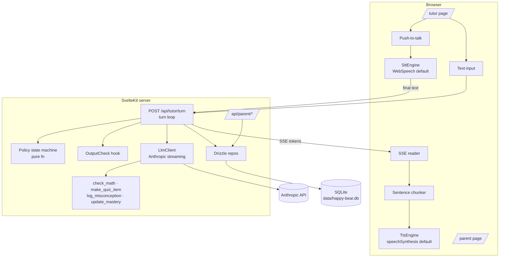

# Happy Bear — Voice-Capable Tutoring Agent Architecture

This document is the contract for evolving Happy Bear from a companion chatbot into a
voice-capable tutoring agent. If implementation diverges, this file is updated in the
same commit. See the Decision Log for changes made along the way.

## 1. Current State (honest inventory, pre-work)

Everything lives in `myapp/` (SvelteKit 2 + Svelte 4, Tailwind, npm — no pnpm on this
machine, `package-lock.json` checked in, Node 24 via `.nvmrc`).

- `src/lib/server/claude.ts` — single non-streaming `messages.create` call to
  `claude-haiku-4-5` (model name hardcoded), persona prompt inline, response parsed as
  `{text, emotion}` JSON. Also canned responses for pat/hug interactions.
- `src/lib/server/db.ts` — better-sqlite3, raw SQL, schema auto-created on first use:
  `sessions`, `messages`, `user_facts`, `interactions`. DB file `myapp/data/happy-bear.db`.
- `src/lib/server/memory.ts` — regex-based fact extraction (name, age, favorites…)
  injected into the system prompt.
- Routes: `api/session` (cookie session), `api/chat` (blocking chat), `api/interact`
  (canned pat/hug). UI: `+page.svelte` + 6 components (TeddyBear SVG w/ emotions,
  ChatPanel, etc.).
- No `tsconfig.json`, no tests, no CI, no streaming, no voice, no safety layer,
  no learner model. `npm run lint` = prettier + eslint only.

Kept as-is: the `/` companion experience, its 3 API routes and tables. New tutor work
is additive; nothing is deleted until a replacement passes tests (nothing needed
deleting — legacy stays as a separate mode).

## 2. Target Architecture



Pedagogy core (`src/lib/pedagogy/`) is framework-free TypeScript: no Svelte, no
SvelteKit, no `$env`, no DB imports. It exports pure functions + types; the server
layer feeds it data and persists its outputs.

### Data flow — one text turn
1. Client POSTs `{sessionId, text}` to `/api/tutor/turn`.
2. Server persists learner turn; loads `LearnerSnapshot` (mastery rows, misconceptions,
   recent turns) via Drizzle.
3. `selectMove(snapshot, lastTurn)` → `Move` + reason (pure, synchronous).
4. Prompt = persona file + move directive + safety guardrails; Anthropic streaming call
   with tools. Tool calls executed server-side mid-stream (check_math etc.), results
   fed back until the model ends its turn.
5. Text deltas stream to the client as SSE events; each sentence passes the pre-emit
   safety check before being sent.
6. Full reply runs through `OutputCheck`; turn persisted with move, tool calls, flags.
7. Client renders tokens as they arrive.

### Data flow — one voice turn
Same as text, plus: hold push-to-talk → Web Speech API interim/final results → release
sends final transcript into step 1. On the way back, the SSE sentence chunker feeds
each complete sentence to `TtsEngine.speak()` immediately — audio starts before the
LLM finishes. Text chat never depends on any voice code path.

## 3. Module Boundaries (TypeScript interfaces)

```ts
// pedagogy (framework-free)
type Move = 'DIAGNOSE' | 'HINT' | 'PROBE' | 'EXPLAIN' | 'PRACTICE' | 'REVIEW';
interface SkillMastery { skillId: string; pRecall: number; state: 'new'|'learning'|'review'|'relearning';
  reps: number; lapses: number; due: Date; stability: number; difficulty: number; }
interface LearnerSnapshot { learnerId: string; mastery: SkillMastery[];
  misconceptions: Misconception[]; activeSkillId: string | null; hintsThisProblem: number; }
interface TurnSummary { role: 'learner'|'tutor'; move: Move | null; answeredCorrectly: boolean | null;
  misconceptionTag: string | null; askedForAnswer: boolean; }
interface PolicyDecision { move: Move; reason: string; targetSkillId: string | null; }
function selectMove(s: LearnerSnapshot, last: TurnSummary | null): PolicyDecision;
function reviewMastery(m: SkillMastery, outcome: 'correct'|'incorrect'|'hesitant', now: Date): SkillMastery; // ts-fsrs

// llm (server)
interface LlmClient { streamTurn(req: TurnRequest): AsyncIterable<LlmEvent>; }
type LlmEvent = { type: 'text'; delta: string } | { type: 'tool_use'; id: string; name: string; input: unknown }
  | { type: 'end'; stopReason: string };

// tools (server)
interface ToolExecutor { name: string; description: string; inputSchema: object;
  execute(input: unknown, ctx: ToolContext): Promise<{ result: string }>; }

// safety (server)
type SafetyVerdict = { action: 'pass' } | { action: 'flag'; reason: string }
  | { action: 'block'; reason: string; replacement: string };
interface OutputCheck { checkChunk(text: string): SafetyVerdict; // pre-emit, per sentence
  checkTurn(fullText: string): SafetyVerdict; } // post-turn

// voice (browser)
interface SttEngine { id: string; isAvailable(): boolean;
  start(o: { lang: string; onPartial(t: string): void; onFinal(t: string): void; onError(e: Error): void }): void;
  stop(): void; }
interface TtsEngine { id: string; isAvailable(): boolean;
  speak(sentence: string): void; flush(): Promise<void>; cancel(): void; }
```

### Pedagogy packaging decision
`myapp/src/lib/pedagogy/` subtree, **not** a pnpm workspace package. Reasons: pnpm is
not installed here and the repo is npm-locked; a single consumer app gains nothing
from a workspace split; framework-freedom is enforced instead by a dedicated
guard test (`framework-free.test.ts` scans every non-test module's imports) and
by the vitest suite running in plain Node with no SvelteKit plugin (D2).

## 4. Storage Schema (Drizzle + SQLite)

Same DB file as legacy; legacy tables untouched. New tables (key fields):

| Table | Fields |
|---|---|
| `learners` | id (pk), display_name, created_at |
| `skills` | id (pk), domain, name, description — seeded with fractions KCs |
| `mastery` | learner_id + skill_id (pk), stability, difficulty, due, state, reps, lapses, p_recall, last_review |
| `misconceptions` | id, learner_id, skill_id, tag, evidence, turn_id, created_at, resolved_at |
| `tutor_sessions` | id (pk), learner_id, mode ('text'\|'voice'), started_at, ended_at |
| `turns` | id, session_id, role, content, move, tool_calls (json), flagged (0/1), flag_reason, created_at |
| `quiz_items` | id, skill_id, prompt, answer, distractors (json), source, created_at |

Migrations via `drizzle-kit generate` checked into `myapp/drizzle/`. Deploy path
(documented only, not built): swap better-sqlite3 driver for `@libsql/client` and
Turso URL/token env vars — Drizzle schema is dialect-compatible; or `drizzle-orm/postgres-js`
with a re-generated migration set for Postgres types (datetime → timestamptz).

## 5. Resource / Latency Budget (voice turn)

Target **time-to-first-audio ≤ 2.0 s p50 / 3.5 s p95** from PTT release:

| Stage | Budget |
|---|---|
| WebSpeech final result after release | ≤ 300 ms |
| Server: persist + snapshot + policy | ≤ 100 ms (local SQLite, pure fn) |
| Anthropic first sentence (streaming) | ≤ 1200 ms (short persona sentences help) |
| Sentence chunk → speechSynthesis start | ≤ 200 ms |

Levers if over budget: smaller model via `ANTHROPIC_MODEL`, prompt caching on persona
block, shorter first sentence enforced by persona prompt.

## 6. Dependency Table

| Dependency | Why |
|---|---|
| `drizzle-orm` | Typed schema/queries over existing better-sqlite3; migration path to libSQL/Postgres |
| `drizzle-kit` (dev) | Generate SQL migrations from schema |
| `ts-fsrs` | FSRS scheduling: per-skill stability/difficulty/due for REVIEW timing |
| `mathjs` | `Fraction`-based exact arithmetic for the `check_math` verifier |
| `vitest` (dev) | Test runner for pedagogy/tools/policy + mocked-LLM integration test |
| `typescript` + `svelte-check` (dev) | Real type gate in CI (repo previously had none) |
| `typescript-eslint` (dev) | eslint could not parse `lang="ts"` svelte blocks; lint gate was broken without it |

No other runtime deps. No analytics, no telemetry; transcripts go only to the
Anthropic API and local SQLite.

## 7. Real vs Stubbed (state at end of this work)

**Real:** pedagogy core + FSRS, policy machine, Drizzle persistence, streaming
Anthropic turn loop with 4 working tools, safety pre-emit/post-turn checks, parent
view, text chat UI, WebSpeech STT + speechSynthesis TTS with push-to-talk and
incremental playback, vitest suites, GitHub Actions CI.

**Stubbed:** server-side Whisper STT (`WhisperServerStt` — interface-conforming,
throws `NotImplemented`), server-side TTS (`ServerTts` — same), Turso/Postgres deploy
(documented §4 only). Output-check is a basic blocklist/heuristic implementation of
a real interface — swapping in a model-based checker is a drop-in.

## 8. Assumption Log

- A1: No pnpm on machine → npm + subtree instead of workspace (§3).
- A2: Legacy companion mode stays at `/`; tutor is `/tutor`, parent view `/parent`.
  "Refactor, don't rewrite" read as: keep legacy working, build tutor alongside.
- A3: Single-learner-per-browser: learner identified by the existing session cookie
  mechanism; multi-user auth out of scope.
- A4: Fractions (Grade ~4–6) is the seed domain: ~6 knowledge components.
- A5: `ANTHROPIC_MODEL` env var with default `claude-sonnet-5`; key from
  `ANTHROPIC_API_KEY` (already in `.env`).
- A6: Parent view is unauthenticated locally (child-safety review before any deploy).
- A7: Chrome is the voice target; other browsers fall back to text-only cleanly.

## 9. Decision Log (append-only)

- D1 (initial): architecture as above.
- D2: pedagogy framework-freedom enforced by a guard test instead of an ESLint
  rule — the repo's eslint didn't parse TS when the rule was designed, and the
  guard test also catches DB/SDK imports.
- D3: policy inputs (`TurnSummary`, `hintsThisProblem`, open problem) are
  derived from persisted turns + tool-call records, not from extra LLM calls:
  the "problem on the table" is the last `make_quiz_item`; the learner's answer
  is pre-checked server-side against it with the same `checkFractionAnswer`
  used by the tool; misconception tags carry over from the previous tutor
  turn's `check_math`/`log_misconception` calls.
- D4: between problems the active skill falls back to the latest open
  misconception's skill (or the sole tracked skill) so the policy doesn't
  reset to DIAGNOSE mid-conversation.
- D5: REVIEW only targets skills still in the 'high' band; an overdue decayed
  skill is re-taught via PRACTICE instead of quick-reviewed.
- D6: the turn endpoint streams SSE from a POST body (fetch-reader on the
  client) rather than EventSource, so the learner text rides the same request.
- D7: companion page gains a 3D bear (`Bear3D.svelte`, procedural Three.js —
  no AI-generated/GLB assets, no rigging pipeline) alongside the SVG bear
  behind a 2D/3D toggle. Same `interact` event contract and `/api/interact`
  flow; limbs are pivoted groups animated on pat/hug/boop/belly-rub clicks.
  Additive to the legacy companion mode; tutor pages untouched.

## 10. Milestone Plan

1. `architecture.md` (this commit).
2. Tooling: tsconfig, vitest config, deps, CI workflow skeleton.
3. Drizzle schema + migrations + fractions skill seed.
4. Pedagogy core: types, FSRS wrapper, `selectMove` + transition-table tests.
5. Tools: check_math / make_quiz_item / log_misconception / update_mastery + tests.
6. Agent layer: persona file, LlmClient (Anthropic + mock), SSE turn endpoint,
   5-turn mocked integration test.
7. Safety: guardrails, OutputCheck, turn flagging, parent view.
8. Voice + tutor UI: text chat first, then STT/TTS engines + push-to-talk.
9. CI green, acceptance pass, doc sync.
